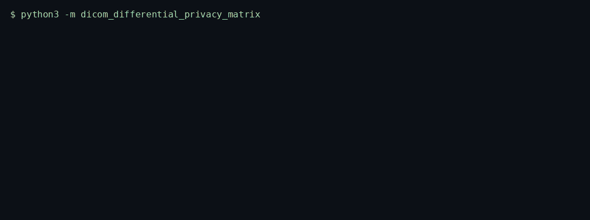
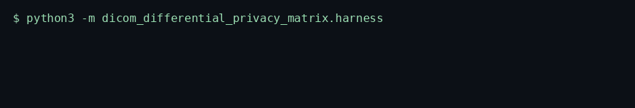
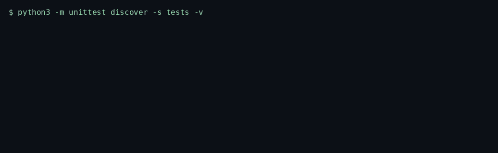

# DICOM Differential Privacy Matrix

> Releases synthetic DICOM numeric tags after identifier suppression, age and postal generalization, and Laplace noise with a running epsilon account.

<p>
  <a href="https://github.com/TechieGoku2623/dicom-differential-privacy-matrix/actions/workflows/ci.yml"></a>
  
  
</p>

| | |
| --- | --- |
| **Website** | https://github.com/TechieGoku2623/dicom-differential-privacy-matrix |
| **Topics** | `python` `asyncio` `healthcare` `dicom` `differential-privacy` `hipaa` `medical-imaging` |

## Walkthrough

### How it works


One real batch, in order: what went in, which gate fired, what came out.

Three recordings from this repository. Each one is the command in the frame, not a drawing.

### Engine

`python3 -m dicom_differential_privacy_matrix`



A missing slice is a dropout. Direct identifiers are dropped. Age is binned. Remaining measurements take Laplace noise scaled by sensitivity / epsilon.

### Benchmark

`python3 -m dicom_differential_privacy_matrix.harness`



5000 iterations, `random.Random(514)`. The frame ends on the status line and `echo $?`.

### Tests

`python3 -m unittest discover -s tests -v`



Wire round-trip, the happy path, and both edge cases below.

## Pipeline

```
tag record
  |
  v
direct id? ---- yes --> suppressed
  |
  no
  v
age bin / postal truncate / clip to [lo, hi]
  |
  v
Laplace noise, epsilon += spent
  |
  v
{suppressed, generalized, noised, epsilon_spent, dropout}
```

## Quick start

```bash
python3 -m venv venv
source venv/bin/activate
pip install -e ".[dev]"
python -m dicom_differential_privacy_matrix
python -m dicom_differential_privacy_matrix.harness
python -m unittest discover -s tests -v
```

Python 3.12. The runtime is the standard library. `black` and `flake8` are the `dev` extra.

## Use it

```python
import asyncio

from dicom_differential_privacy_matrix import DicomDifferentialPrivacyMatrix


async def demo() -> None:
    engine = DicomDifferentialPrivacyMatrix(epsilon=0.8, seed=17)
    report = await engine.run(
        [
            {
                "tag": 0x00101010,
                "value": 47.0,
                "slice_index": 0,
                "series": 3,
                "missing": False,
            }
        ]
    )
    spent = float(report["epsilon_spent"])
    generalized = int(report["generalized"])
    print(spent, generalized, report["released"][0]["value"])


asyncio.run(demo())
```

## Bounds

| | |
| --- | ---: |
| Iterations | 5000 |
| Average | 82.7 µs |
| P99 | 109.286 µs |
| tracemalloc peak | 295113 bytes |

Figures are from the harness on the machine that published them. A later host moves the microseconds. The pass/fail result does not.

## What it refuses

- A missing slice increments `dropout` and emits no measurement.
- `math.inf` and NaN raise `EngineKernelException` before noise is applied.

Aligned with HIPAA Safe Harbor suppression and generalization. Epsilon spent is reported. This is not a formal privacy proof and it is not a certified de-identification product.

## Tree

```
src/dicom_differential_privacy_matrix/
  engine.py       kernel
  wire.py         struct frames
  harness.py      benchmark
  __main__.py     demo entry
tests/test_engine.py
Dockerfile        non-root, uid 10001
```
